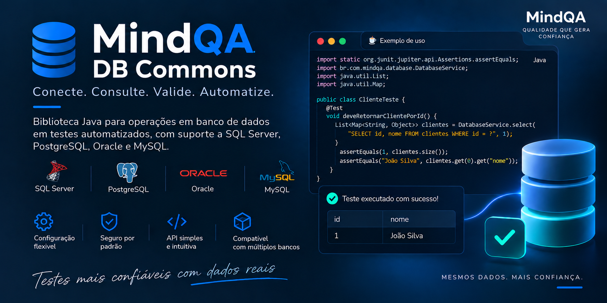

<p align="center">
  
</p>

[](https://mvnrepository.com/artifact/io.github.raialmeida/mindqa-db-commons)
[](https://github.com/raialmeida/mindqa-db-commons/actions/workflows/ci.yml)

Biblioteca Java para executar CRUD em **SQL Server, PostgreSQL, Oracle e MySQL**
com configuração por variáveis de ambiente ou arquivos `.properties`.
Use uma conexão padrão ou selecione conexões e bases diferentes no mesmo teste.
Por padrão, cada operação abre e fecha sua própria conexão JDBC. Pool de conexões
e cache de configuração podem ser habilitados separadamente.

Documentação completa: [Wiki do GitHub](https://github.com/raialmeida/mindqa-db-commons/wiki).

Funciona em automações Java 11+ de API, interface e integração. Pode ser usada com
RestAssured, Selenium, Cucumber, JUnit ou TestNG. O código da biblioteca não depende
desses frameworks; JUnit e H2 são usados somente nos testes do próprio projeto.

- [Instalação](#instalação)
- [Início rápido](#início-rápido)
- [API pública e CRUD](#api-pública)
- [Arquivos e variáveis de configuração](#configuração-com-qualquer-arquivo-properties)
- [Conexões e bases diferentes](#conexões-e-bases-diferentes-no-mesmo-teste)
- [POST com RestAssured e validação no banco](#post-cadastrar-pela-api-e-validar-no-banco)
- [Conexões, erros e validação](#conexões-erros-e-validação)
- [Desenvolvimento e testes](#desenvolvimento-e-testes)

## Instalação

Requisitos: JDK 11 ou superior e Maven 3.6.3 ou superior.

Para testar alterações locais nesta biblioteca antes de publicá-las, execute:

```bash
mvn clean install
```

Isso executa os testes e instala no repositório Maven local o JAR da biblioteca,
o JAR de fontes e o JAR de Javadoc, gerados em `target/`. Após publicar esta nova
versão no Maven Central, adicione ao `pom.xml` do projeto de automação:

```xml
<dependency>
    <groupId>io.github.raialmeida</groupId>
    <artifactId>mindqa-db-commons</artifactId>
    <version>4.0.0</version>
    <scope>test</scope>
</dependency>
```

Os drivers JDBC e o Apache DbUtils são resolvidos transitivamente. RestAssured e o
framework de testes continuam sendo dependências do projeto de automação.
Remova `<scope>test</scope>` se precisar usar a biblioteca em código de produção.
Os quatro drivers vêm na dependência; somente a conexão escolhida pela operação é
aberta. Não é necessário configurar servidores que você não utiliza.

| Banco | Driver incluído | Porta padrão |
| --- | --- | --- |
| SQL Server | `com.microsoft.sqlserver:mssql-jdbc:13.6.0.jre11` | `1433` |
| PostgreSQL | `org.postgresql:postgresql:42.7.13` | `5432` |
| Oracle | `com.oracle.database.jdbc:ojdbc11:23.26.3.0.0` | `1521` |
| MySQL | `com.mysql:mysql-connector-j:9.7.0` | `3306` |

Até a publicação de `4.0.0`, instale esta versão localmente com `mvn clean install`.
Se estiver usando a versão publicada `1.0.1`, selecione o arquivo de configuração
explicitamente e consulte a documentação correspondente àquela versão.

## Início rápido

Depois de adicionar a dependência, crie este arquivo no **projeto de automação**:
`src/test/resources/database.properties`. A biblioteca o carrega automaticamente,
sem `-Ddb.config`. Substitua os valores pelos do seu ambiente.

```properties
DB_DEFAULT_CONNECTION=postgresql
POSTGRESQL_HOST=localhost
POSTGRESQL_PORT=5432
POSTGRESQL_USER=qa_user
POSTGRESQL_PASS=sua_senha
POSTGRESQL_NAME=qa_database
```

Se o teste usa apenas um banco, escolha um dos blocos abaixo e defina-o como
conexão padrão. Também é possível manter PostgreSQL, SQL Server, MySQL e Oracle
no mesmo arquivo: nesse caso, declare cada conjunto de credenciais com seu
prefixo e mantenha apenas um `DB_DEFAULT_CONNECTION`; as demais conexões são
selecionadas pelo nome, como explicado em [conexões e bases diferentes](#conexões-e-bases-diferentes-no-mesmo-teste).

```properties
DB_DEFAULT_CONNECTION=sqlserver
SQLSERVER_HOST=localhost
SQLSERVER_PORT=1433
SQLSERVER_USER=qa_user
SQLSERVER_PASS=sua_senha
SQLSERVER_NAME=qa_database
```

```properties
DB_DEFAULT_CONNECTION=mysql
MYSQL_HOST=localhost
MYSQL_PORT=3306
MYSQL_USER=qa_user
MYSQL_PASS=sua_senha
MYSQL_NAME=qa_database
```

```properties
DB_DEFAULT_CONNECTION=oracle
ORACLE_HOST=localhost
ORACLE_PORT=1521
ORACLE_USER=qa_user
ORACLE_PASS=sua_senha
ORACLE_NAME=FREEPDB1
```

Execute os testes normalmente:

```bash
mvn test
```
### Seleção por ambiente

O arquivo pode ter qualquer nome, por exemplo `ambientes/minha-api-qa.properties`.
Escolha um arquivo por execução:

```bash
mvn test -Ddb.config=ambientes/minha-api-qa.properties
mvn test -Ddb.config=ambientes/minha-api-hml.properties
```

Se usar `database-qa.properties` na raiz dos resources, pode selecionar com
`-Ddb.env=qa` ou `DB_ENV=qa`. A seleção segue `-Ddb.config`, `DB_CONFIG`,
`-Ddb.env`, `DB_ENV` e, sem seletor explícito, `database.properties` na raiz do
classpath. Um arquivo explicitamente selecionado que não exista gera erro; o
arquivo padrão é opcional. Se ele não existir, a biblioteca usa as variáveis de
ambiente e indica no erro de configuração quando nenhum arquivo foi selecionado.
As variáveis de ambiente prevalecem sobre as mesmas chaves do arquivo carregado.
Outros arquivos `.properties` e arquivos `.env` não são descobertos automaticamente.
Propriedades JVM como `-Ddb.host` não fornecem credenciais.
Dentro de um teste, consulte pela API estática:

```java
import br.com.mindqa.database.DatabaseService;

import java.util.List;
import java.util.Map;

List<Map<String, Object>> clientes = DatabaseService.select(
        "SELECT id, nome, email FROM clientes WHERE id = ?", "cliente-1");
```

A chamada usa PostgreSQL e a base `qa_database`. A tabela deve existir; nos exemplos
Java deste README, `clientes` possui `id VARCHAR(36)` como chave primária,
`nome VARCHAR(100)` e `email VARCHAR(150)`. Adapte o SQL e os tipos à sua aplicação.

O [arquivo de exemplo do projeto](src/test/resources/database.properties) declara
os quatro motores e também escolhe `postgresql` como padrão. Para escolher outro,
altere `DB_DEFAULT_CONNECTION` para `sqlserver`, `mysql` ou `oracle`, mantendo as
credenciais correspondentes. Com somente uma conexão configurada, esse seletor
pode ser omitido.

## API pública

```java
import br.com.mindqa.database.DatabaseService;
```

| Método | Retorno |
| --- | --- |
| `select(String sql, Object... params)` | `List<Map<String, Object>>` |
| `execute(String sql, Object... params)` | `int` |
| `database(String name)` | `DatabaseClient` para outra base da conexão padrão |
| `connection(String name)` | `DatabaseClient` para a conexão selecionada |
| `connection(String name).database(String name)` | `DatabaseClient` para outra base da conexão selecionada |

As operações estáticas usam a conexão e a base padrão. O cliente retornado por
`connection(nome)` oferece `select` e `execute` para a conexão escolhida.
O tipo do banco e as credenciais vêm da configuração, sem parâmetros adicionais
de tipo nos métodos de consulta.
Falhas JDBC geram uma `DatabaseException`. Sua mensagem é a mesma do driver, e a
`SQLException` original fica disponível em `getCause()` e `getSQLException()`.

`select` retorna uma lista vazia quando não há resultados. Cada mapa representa uma
linha e usa os nomes ou aliases das colunas como chaves; os valores mantêm os tipos
retornados pelo JDBC. `execute` serve para `INSERT`, `UPDATE` e `DELETE` e
retorna a quantidade de linhas afetadas, não o ID gerado.

Use `?` para valores e passe os parâmetros na mesma ordem. Para um único SQL `NULL`,
use `(Object) null`. O SQL deve seguir o dialeto do banco selecionado.
Placeholders não substituem nomes de tabelas, colunas ou bancos. SQL nulo ou em
branco e arrays de parâmetros nulos são rejeitados antes de abrir conexão.

### CRUD

O exemplo abaixo prepara um cliente, consulta seus dados, atualiza o nome e
remove o registro ao terminar. O email único evita reutilizar o dado de outra execução.

```java
import br.com.mindqa.database.DatabaseService;

import java.util.List;
import java.util.Map;
import java.util.UUID;

String id = UUID.randomUUID().toString();
String email = "qa-" + id + "@example.com";

int inseridos = DatabaseService.execute(
        "INSERT INTO clientes (id, nome, email) VALUES (?, ?, ?)",
        id, "Cliente QA", email);

List<Map<String, Object>> clientes = DatabaseService.select(
        "SELECT id, nome, email FROM clientes WHERE id = ?", id);

int atualizados = DatabaseService.execute(
        "UPDATE clientes SET nome = ? WHERE id = ?", "Cliente atualizado", id);
int removidos = DatabaseService.execute("DELETE FROM clientes WHERE id = ?", id);
```

### Outra base na conexão padrão

```java
List<Map<String, Object>> produtos = DatabaseService
        .database("ServeRestExemplo")
        .select(
                "SELECT Id, Nome, Preco, Descricao, Quantidade FROM dbo.Produtos WHERE Id = ?",
                "produto-002");
```

`database(nome)` mantém tipo, host, porta, credenciais e demais opções da conexão
padrão, alterando somente a base usada pela operação.

### Outra base em uma conexão selecionada

```java
// Mantém tipo, host, porta e credenciais da conexão selecionada.
var auditoria = DatabaseService.connection("postgresql").database("qa_auditoria");

auditoria.select("SELECT nome FROM clientes WHERE id = ?", "cliente-1");
auditoria.execute("UPDATE clientes SET nome = ? WHERE id = ?",
        "Cliente atualizado", "cliente-1");
```

## Configuração com qualquer arquivo `.properties`

O arquivo pertence ao **projeto de automação que consome a biblioteca**. Pode ter
qualquer nome, estar em subpastas de `src/test/resources` ou ser um arquivo externo.
O nome é livre; as chaves de conexão devem seguir a tabela de configuração abaixo.
Outras propriedades do mesmo arquivo são ignoradas.

### Prefixo por tipo de banco

O prefixo identifica o tipo e o nome da conexão, sem exigir `*_TYPE`:

| Banco | Prefixo | Nome em `connection(...)` | Exemplo de base ou serviço |
| --- | --- | --- | --- |
| PostgreSQL | `POSTGRESQL_*` | `postgresql` | `POSTGRESQL_NAME=qa_database` |
| SQL Server | `SQLSERVER_*` | `sqlserver` | `SQLSERVER_NAME=qa_database` |
| MySQL | `MYSQL_*` | `mysql` | `MYSQL_NAME=qa_database` |
| Oracle | `ORACLE_*` | `oracle` | `ORACLE_NAME=FREEPDB1` |

Com apenas um desses prefixos configurado, a biblioteca seleciona essa conexão
automaticamente. Com dois ou mais prefixos, defina `DB_DEFAULT_CONNECTION` para
usar `DatabaseService.select(...)`, `DatabaseService.execute(...)` ou
`DatabaseService.database(...)`. Se cada chamada usar
`DatabaseService.connection("nome")`, o padrão pode ser omitido.

O início rápido mostra uma configuração completa para PostgreSQL. Para outro
motor, utilize seu prefixo nas mesmas chaves e ajuste os valores. As portas
omitidas seguem os padrões da tabela de drivers. O arquivo de exemplo contém
as quatro configurações completas.

Os arquivos são lidos como UTF-8 usando a sintaxe Java Properties. Senhas seguem
as regras de escape do formato Properties e não são aparadas pela biblioteca.
Também são aceitos arquivos com BOM e chaves em minúsculas separadas por pontos,
como `oracle.host` e `mysql.pass`. Valores como `${DB_PASS}` não são interpolados.
O caminho no classpath começa depois de `src/test/resources/`. A IDE também carrega
`database.properties` automaticamente quando o recurso está no classpath de testes.
Para escolher outro arquivo, configure `-Ddb.config` nas opções da JVM ou use `DB_CONFIG`.


### Arquivo externo ou recurso explícito

```bash
# Restringe a busca ao classpath
mvn test -Ddb.config=classpath:ambientes/minha-api-qa.properties

# Lê um caminho relativo ao diretório de execução
mvn test -Ddb.config=file:./config/qa.properties

# Lê um caminho absoluto
mvn test -Ddb.config=/opt/automacao/config/hml.properties
```

Sem prefixo, a busca ocorre primeiro no classpath e depois no sistema de arquivos.
`file:` recebe um caminho de arquivo; não faz download de URLs. Se o arquivo
selecionado não existir, não puder ser lido ou tiver um escape inválido, a chamada
falha com `IllegalStateException`, mesmo que as variáveis de conexão estejam definidas.
Os recursos de leitura são fechados após o carregamento.

### Variáveis de ambiente

As chaves são as mesmas no arquivo e no ambiente. Defina-as no terminal que inicia
o Maven, nas opções de ambiente da IDE ou no pipeline. Exemplo para uma conexão MySQL:

```bash
export MYSQL_HOST=localhost
export MYSQL_USER=qa_user
export MYSQL_PASS='sua_senha'
export MYSQL_NAME=qa_database
mvn test
```

É possível manter host, usuário e base no arquivo e fornecer somente a senha pelo
ambiente. Para isso, remova a senha do arquivo e defina, por exemplo,
`MYSQL_PASS` no pipeline. Os valores não são interpolados dentro do `.properties`.

As opções adicionais usam as mesmas chaves como variáveis de ambiente. Coloque
`DB_DRIVER_PROPERTIES` entre aspas no shell porque `&` possui significado especial:

```bash
export SQLSERVER_ENCRYPT=true
export SQLSERVER_TRUST_SERVER_CERTIFICATE=false
export SQLSERVER_DRIVER_PROPERTIES='applicationName=qa-automation&authenticationScheme=javaKerberos'
```

### Campos por conexão

Substitua `<PREFIXO>` por `POSTGRESQL`, `SQLSERVER`, `MYSQL` ou `ORACLE`.

| Chave | Obrigatória | Descrição |
| --- | --- | --- |
| `<PREFIXO>_HOST` | Sim | Host, IPv4 ou IPv6, sem porta, URL ou parâmetros JDBC. |
| `<PREFIXO>_PORT` | Não | Porta entre 1 e 65535; omitida ou em branco usa o padrão do motor. |
| `<PREFIXO>_USER` | Sim | Usuário de conexão. |
| `<PREFIXO>_PASS` | Sim | Senha; valor vazio é preservado se o servidor permitir. |
| `<PREFIXO>_NAME` | Condicional | Base de dados ou service name Oracle. Dispensável quando selecionado com `database(nome)`. |
| `<PREFIXO>_QUERY_TIMEOUT_SECONDS` | Não | Timeout de execução do statement, em segundos. Padrão: `0`. |
| `<PREFIXO>_LOGIN_TIMEOUT_SECONDS` | Não | Timeout de conexão, em segundos. Padrão: `0`. |
| `<PREFIXO>_ENCRYPT` | Não | Criptografia do SQL Server: `true`, `false` ou `strict`. Padrão: `false`. |
| `<PREFIXO>_TRUST_SERVER_CERTIFICATE` | Não | Confiança no certificado do SQL Server: `true` ou `false`. Padrão: `false`. |
| `<PREFIXO>_DRIVER_PROPERTIES` | Não | Propriedades adicionais entregues ao driver no formato `chave=valor&outra=valor`. |

### Configuração simples `DB_*`

Continua suportada, sem necessidade de migrar configurações existentes:

| Variável | Obrigatória | Descrição |
| --- | --- | --- |
| `DB_TYPE` | Não | `sqlserver`, `postgres` (ou `postgresql`), `oracle` ou `mysql` (padrão: `sqlserver`). |
| `DB_HOST` | Sim | Host ou endereço IP. |
| `DB_PORT` | Não | Porta entre 1 e 65535. |
| `DB_USER` | Sim | Usuário de conexão. |
| `DB_PASS` | Sim | Senha; valor vazio é preservado. |
| `DB_NAME` | Condicional | Banco ou service name Oracle. Dispensável ao selecionar o destino com `database(nome)`. |
| `DB_QUERY_TIMEOUT_SECONDS` | Não | Timeout de query em segundos (padrão: 0). |
| `DB_LOGIN_TIMEOUT_SECONDS` | Não | Timeout de conexão em segundos (padrão: 0). |
| `DB_ENCRYPT` | Não | Criptografia do SQL Server: `true`, `false` ou `strict` (padrão: `false`). |
| `DB_TRUST_SERVER_CERTIFICATE` | Não | Confiança no certificado do SQL Server: `true` ou `false` (padrão: `false`). |
| `DB_DRIVER_PROPERTIES` | Não | Propriedades adicionais entregues ao driver. |

IPv6 pode ser informado como `::1` ou `[::1]`. O arquivo também aceita `db.type`,
`db.host`, `db.port`, `db.user`, `db.pass`, `db.name` e as chaves de timeout com pontos.
Na configuração simples, `DB_TYPE` ausente ou em branco usa SQL Server;
nos prefixos por motor, o tipo é inferido pelo prefixo. A porta segue o motor
selecionado. Host, usuário e banco devem ser não vazios. Um `dbName` nulo ou em
branco em `database(nome)` usa o nome configurado.

As variáveis de ambiente prevalecem sobre o arquivo, inclusive quando vazias.
No arquivo, chaves em maiúsculas prevalecem sobre a forma em minúsculas.
As regras para escolher entre a configuração simples e as conexões nomeadas
estão na seção de múltiplas conexões abaixo.

O timeout de query aceita valores de `0` a `2147483647`; o de conexão, de `0` a
`65535`, sempre informados em segundos. `0` preserva o padrão de conexão do driver
e não estabelece limite de query pela biblioteca. A propriedade JDBC usada é
`loginTimeout` para SQL Server/PostgreSQL, `oracle.jdbc.loginTimeout` para Oracle
e `connectTimeout` em milissegundos para MySQL. Neste último, limita a abertura
do socket. Não há alteração do timeout global do `DriverManager`.
O timeout de query não limita a duração total da chamada, que também inclui ler
a configuração, conectar e processar o resultado.

### URLs JDBC e particularidades dos motores

As URLs são montadas automaticamente; usuário e senha são enviados separadamente.

| Banco | URL com host e porta padrão |
| --- | --- |
| SQL Server | `jdbc:sqlserver://localhost:1433;databaseName=qa_database;encrypt=false;trustServerCertificate=false;` |
| PostgreSQL | `jdbc:postgresql://localhost:5432/qa_database` |
| MySQL | `jdbc:mysql://localhost:3306/qa_database` |
| Oracle | `jdbc:oracle:thin:@//localhost:1521/FREEPDB1` |

No SQL Server, `encrypt` e `trustServerCertificate` usam `false` por padrão e
podem ser configurados por conexão:

```properties
SQLSERVER_ENCRYPT=true
SQLSERVER_TRUST_SERVER_CERTIFICATE=false
```

Em uma conexão nomeada, use por exemplo
`DB_CONNECTIONS_LEGADO_ENCRYPT=true`. `encrypt` aceita `true`, `false` ou `strict`;
`trustServerCertificate` aceita `true` ou `false`. Outros valores são rejeitados
antes da abertura da conexão.

Propriedades adicionais de qualquer driver podem ser definidas por conexão:

```properties
POSTGRESQL_DRIVER_PROPERTIES=ApplicationName=qa-automation&sslmode=require
DB_CONNECTIONS_LEGADO_DRIVER_PROPERTIES=applicationName=qa-legado
```

Separe as propriedades com `&` e use codificação percentual quando o nome ou valor
contiver `&`, `=` ou espaços; por exemplo, `applicationName=qa%20automation`.
As chaves são entregues ao driver preservando a grafia. Não são aceitas duplicatas
nem propriedades controladas pela biblioteca, como usuário, senha, host, porta,
base, `encrypt`, `trustServerCertificate` e timeouts. Configure esses valores pelas
chaves específicas. Variáveis de ambiente continuam prevalecendo sobre o arquivo.

As demais opções não informadas seguem os padrões dos drivers. Nomes de base com
caracteres especiais recebem os escapes necessários para compor a URL.

No Oracle, `ORACLE_NAME` é o **service name**, não o SID nem o schema. Esse nome aceita
letras ASCII, números, `_`, `.`, `$` e `-`. A conexão usa JDBC Thin por TCP.
Para consultar outro schema, qualifique a tabela no SQL, como `outro_schema.clientes`.

O Connector/J incluído suporta MySQL 8.0 ou superior, conforme suas
[notas de versão](https://dev.mysql.com/doc/relnotes/connector-j/en/news-9-7-0.html).

## Conexões e bases diferentes no mesmo teste

Cada prefixo define uma conexão independente. O arquivo
[database.properties](src/test/resources/database.properties) contém exemplos dos
quatro motores. No teste, escolha a conexão pelo nome e, quando necessário, informe
uma base diferente com `database(nome)`.

```java
import br.com.mindqa.database.DatabaseService;
import org.junit.jupiter.api.Test;

import java.util.List;
import java.util.Map;

import static org.junit.jupiter.api.Assertions.assertEquals;

class ConsultaMultiplosBancosTest {
    @Test
    void deveConsultarDuasBasesNoMesmoTeste() {
        String id = "cliente-1";
        String sql = "SELECT email FROM clientes WHERE id = ?";

        // Cada cliente usa suas próprias credenciais e pode apontar para uma base diferente.
        List<Map<String, Object>> clientes = DatabaseService.connection("postgresql")
                .database("qa_clientes")
                .select(sql, id);
        List<Map<String, Object>> auditoria = DatabaseService.connection("mysql")
                .database("qa_auditoria")
                .select(sql, id);

        assertEquals(1, clientes.size());
        assertEquals(1, auditoria.size());
        assertEquals("cliente@example.com", clientes.get(0).get("email"));
        assertEquals("cliente@example.com", auditoria.get(0).get("email"));
    }
}
```

O exemplo pressupõe que o mesmo `id` exista nas duas bases. Para SQL Server ou
Oracle, troque apenas o nome da conexão e o nome da base. A classe
[DatabaseQueryExamples](src/test/java/br/com/mindqa/database/exemplo/DatabaseQueryExamples.java)
também contém exemplos compiláveis de CRUD e consulta em múltiplos motores e bases.
Seus métodos ilustrativos não executam automaticamente no build.

`connection(nome)` escolhe o conjunto de tipo, host, porta e credenciais.
`database(base)` escolhe uma base nesse servidor; no Oracle, escolhe outro
service name. O cliente retornado oferece `select` e `execute`.
São operações JDBC independentes: não existe transação compartilhada nem uma
consulta SQL única que faça JOIN entre servidores pela biblioteca.

### Nomes próprios e dois servidores do mesmo tipo

Para nomes como `principal` e `erp`, configure no arquivo:

```properties
db.default.connection=principal
db.connections.principal.type=postgres
db.connections.principal.host=postgres.qa.interno
db.connections.principal.user=qa_user
db.connections.principal.pass=senha-postgres-de-testes
db.connections.principal.name=clientes

db.connections.erp.type=oracle
db.connections.erp.host=oracle.qa.interno
db.connections.erp.user=qa_user
db.connections.erp.pass=senha-oracle-de-testes
db.connections.erp.name=FREEPDB1

# Outro servidor PostgreSQL, com seu próprio destino e suas credenciais.
db.connections.replica.type=postgres
db.connections.replica.host=replica.qa.interno
db.connections.replica.user=qa_user
db.connections.replica.pass=senha-replica-de-testes
db.connections.replica.name=clientes_replica
```

Outra conexão pode ter o mesmo `type` com outro host, usuário ou banco. Os nomes
aceitam letras ASCII e números, começando com uma letra; use minúsculas nas
propriedades com pontos. Todas as opções são independentes por conexão, incluindo
`port`, timeouts, segurança do SQL Server e propriedades adicionais do driver.

| Propriedade | Variável de ambiente equivalente |
| --- | --- |
| `db.default.connection` | `DB_DEFAULT_CONNECTION` |
| `db.connections.erp.type` | `DB_CONNECTIONS_ERP_TYPE` |
| `db.connections.erp.host` | `DB_CONNECTIONS_ERP_HOST` |
| `db.connections.erp.port` | `DB_CONNECTIONS_ERP_PORT` |
| `db.connections.erp.user` | `DB_CONNECTIONS_ERP_USER` |
| `db.connections.erp.pass` | `DB_CONNECTIONS_ERP_PASS` |
| `db.connections.erp.name` | `DB_CONNECTIONS_ERP_NAME` |
| `db.connections.erp.query.timeout.seconds` | `DB_CONNECTIONS_ERP_QUERY_TIMEOUT_SECONDS` |
| `db.connections.erp.login.timeout.seconds` | `DB_CONNECTIONS_ERP_LOGIN_TIMEOUT_SECONDS` |

Também é aceito `ORACLE_ERP_HOST`, `ORACLE_ERP_USER`, `ORACLE_ERP_PASS`,
`ORACLE_ERP_NAME` (ou `oracle.erp.*`) para declarar `erp` com tipo inferido.
Não é necessário declarar `ORACLE_ERP_TYPE`. Um tipo explícito deve concordar
com o prefixo, e cada nome deve identificar um único destino.

Se os dois formatos declararem o mesmo nome, variáveis de ambiente têm prioridade
sobre o arquivo e chaves `DB_CONNECTIONS_*` prevalecem sobre as chaves por tipo
dentro da mesma fonte. Prefira uma única forma por conexão. Nenhuma conexão nomeada
herda credenciais ou timeouts da raiz `DB_*` ou de outros nomes.

```java
import br.com.mindqa.database.DatabaseClient;
import br.com.mindqa.database.DatabaseService;

String id = "cliente-1";
String sql = "SELECT nome FROM clientes WHERE id = ?";

DatabaseService.select(sql, id); // principal
DatabaseService.connection("replica").select(sql, id);

DatabaseClient erp = DatabaseService.connection("erp");
erp.select(sql, id);
erp.database("OUTROSERVICO").select(sql, id);
```

O cliente guarda somente os nomes da conexão e da base selecionadas e pode ser reutilizado em paralelo. Não abre JDBC
ao ser criado e não precisa ser fechado; cada operação obtém sua configuração e usa
uma conexão exclusiva enquanto executa. Não altere propriedades globais para trocar de
banco durante testes paralelos: selecione o cliente apropriado.

### Escolha da conexão padrão

1. Nome explícito em `DatabaseService.connection(nome)`, quando usado.
2. `DB_DEFAULT_CONNECTION` ou `db.default.connection`, quando não vazio.
3. Configuração simples `DB_*`, se houver algum campo de conexão na raiz.
4. A única conexão nomeada, incluindo prefixos por tipo, se não houver configuração simples.

Com várias conexões nomeadas, incluindo vários prefixos por banco, e sem uma
configuração simples `DB_*`, os métodos que dependem da conexão padrão exigem
`DB_DEFAULT_CONNECTION`. Sem esse padrão, eles falham pedindo uma seleção
explícita. Chamadas com `connection(nome)` não dependem de
`DB_DEFAULT_CONNECTION`.
Nomes desconhecidos, prefixos conflitantes para o mesmo nome ou configurações
incompletas geram erro; não há fallback silencioso para outro destino.
Sem nenhuma configuração de conexão, a biblioteca informa os campos obrigatórios
ausentes. Se só configurar `MYSQL_*`, `DatabaseService.select(...)` já usa MySQL.
Quando configurar vários, defina `DB_DEFAULT_CONNECTION=mysql` ou escolha a conexão
em cada chamada. Configure somente os servidores que precisa utilizar.

## Exemplos com RestAssured e JUnit 5

Os exemplos abaixo pertencem ao projeto de automação que consome a biblioteca e
pressupõem RestAssured e JUnit 5 já configurados. Adapte tabela, campos, URL e rota
para sua aplicação. A API de exemplo grava e consulta a tabela `clientes` descrita
acima. A conexão configurada para o teste deve apontar para o banco usado pela API
no mesmo ambiente.

### POST: cadastrar pela API e validar no banco

Neste exemplo, `POST /clientes` recebe `nome` e `email`, gera o `id` e retorna
HTTP `201` com um JSON contendo esse `id`. A gravação deve estar concluída antes
da resposta. Configure a conexão padrão com o banco usado pela API: SQL Server,
PostgreSQL, Oracle ou MySQL. O tipo não precisa ser passado nos métodos Java.

Crie `src/test/java/CadastroClienteTest.java` no projeto de automação:

```java
import br.com.mindqa.database.DatabaseService;
import io.restassured.http.ContentType;
import org.junit.jupiter.api.Test;

import java.util.List;
import java.util.Map;
import java.util.UUID;

import static io.restassured.RestAssured.given;
import static org.junit.jupiter.api.Assertions.assertEquals;
import static org.junit.jupiter.api.Assertions.assertNotNull;

class CadastroClienteTest {
    @Test
    void deveCadastrarClienteEPersistirDados() {
        String nome = "Cliente QA";
        String email = "qa-" + UUID.randomUUID() + "@example.com";
        String corpo = String.format("{\"nome\":\"%s\",\"email\":\"%s\"}", nome, email);

        // 1. Cadastra pela API e captura o ID retornado.
        String id = given()
                .baseUri("http://localhost:8080")
                .contentType(ContentType.JSON)
                .body(corpo)
        .when()
                .post("/clientes")
        .then()
                .statusCode(201)
                .extract().jsonPath().getString("id");

        assertNotNull(id, "A API deve retornar o ID do cadastro");

        // 2. Consulta o registro e compara com os dados enviados no POST.
        List<Map<String, Object>> clientes = DatabaseService.select(
                "SELECT nome, email FROM clientes WHERE id = ?", id);

        assertEquals(1, clientes.size(), "O cadastro deve existir no banco");
        assertEquals(nome, clientes.get(0).get("nome"));
        assertEquals(email, clientes.get(0).get("email"));

        // 3. Remove o dado exclusivo deste teste.
        DatabaseService.execute("DELETE FROM clientes WHERE email = ?", email);
    }
}
```

Com `database.properties` no classpath do projeto de automação, execute:

```bash
mvn test -Dtest=CadastroClienteTest
```

Para escolher um arquivo de outro ambiente, informe `-Ddb.config` ou `-Ddb.env`:

```bash
mvn test -Dtest=CadastroClienteTest -Ddb.env=qa
```

Se `database.properties` não existir, o primeiro comando também funciona com
somente as variáveis de conexão no processo que inicia o Maven.

O email único identifica o dado criado por essa execução e facilita a limpeza.
Em projetos que precisam limpar dados mesmo quando uma asserção falha, mova a
remoção para a estratégia de teardown usada pela sua suíte. Ajuste a limpeza se
o cadastro também criar registros em outras tabelas.

Para validar o cadastro em uma conexão nomeada, crie
`DatabaseClient banco = DatabaseService.connection("principal")` no teste e use
`banco.select(...)` na consulta e `banco.execute(...)` na limpeza. Importe
`br.com.mindqa.database.DatabaseClient`. O POST com RestAssured permanece igual.

### GET: consultar dados preparados pelo teste

Este cenário insere e atualiza um registro no banco antes de consultar a API.
`GET /clientes/{id}` deve devolver `id`, `nome` e `email`. Pode ser usado com
PostgreSQL, SQL Server ou outro motor suportado, selecionando a conexão padrão
correspondente ao banco da API.

```java
import br.com.mindqa.database.DatabaseService;
import org.junit.jupiter.api.Test;

import java.util.UUID;

import static io.restassured.RestAssured.given;
import static org.hamcrest.Matchers.equalTo;
import static org.junit.jupiter.api.Assertions.assertEquals;

class ConsultaClienteTest {
    @Test
    void deveConsultarClienteAtualizado() {
        String id = UUID.randomUUID().toString();
        String email = "qa-" + id + "@example.com";

        assertEquals(1, DatabaseService.execute(
                "INSERT INTO clientes (id, nome, email) VALUES (?, ?, ?)",
                id, "Cliente inicial", email));
        assertEquals(1, DatabaseService.execute(
                "UPDATE clientes SET nome = ? WHERE id = ?", "Cliente atualizado", id));

        given()
                .baseUri("http://localhost:8080")
                .pathParam("id", id)
        .when()
                .get("/clientes/{id}")
        .then()
                .statusCode(200)
                .body("id", equalTo(id))
                .body("nome", equalTo("Cliente atualizado"))
                .body("email", equalTo(email));

        DatabaseService.execute("DELETE FROM clientes WHERE id = ?", id);
    }
}
```

## Conexões, erros e validação

### Reutilização opcional de conexões e configuração

As duas otimizações ficam **desativadas por padrão**. As configurações existentes
continuam abrindo uma conexão por operação e relendo o arquivo.

Para uma conexão configurada com `DB_TYPE`, `DB_HOST` e demais chaves `DB_*`,
adicione ao arquivo `.properties` ou exporte as variáveis equivalentes:

```properties
DB_CONFIG_CACHE_ENABLED=true
DB_POOL_ENABLED=true
DB_POOL_MAX_SIZE=5
DB_POOL_CONNECTION_TIMEOUT_MS=30000
```

| Opção | Padrão | Comportamento |
| --- | --- | --- |
| `DB_CONFIG_CACHE_ENABLED` | `false` | Reutiliza a configuração carregada, evitando leitura e parsing do arquivo a cada operação. É uma opção global. |
| `DB_POOL_ENABLED` | `false` | Reutiliza conexões JDBC com HikariCP, mantendo uma conexão exclusiva por operação em andamento. |
| `DB_POOL_MAX_SIZE` | `5` | Máximo de conexões físicas por pool; mínimo `1`. |
| `DB_POOL_CONNECTION_TIMEOUT_MS` | `30000` | Espera máxima por uma conexão disponível, em milissegundos; mínimo `1000`. Não substitui o login timeout do driver. |

As opções de pool pertencem à conexão selecionada. Para a conexão `postgresql`,
use `POSTGRESQL_POOL_ENABLED=true`; para uma conexão nomeada `principal`, use
`DB_CONNECTIONS_PRINCIPAL_POOL_ENABLED=true`. Aplique os mesmos prefixos a
`POOL_MAX_SIZE` e `POOL_CONNECTION_TIMEOUT_MS`. As opções `DB_POOL_*` não são
herdadas pelas conexões nomeadas. A precedência das variáveis de ambiente sobre
o arquivo continua valendo, inclusive para essas opções.

Cada combinação de conexão, base, credenciais e opções do pool mantém seu próprio
pool. Assim, `database(nome)` não mistura conexões de bases diferentes. São mantidos
até 32 pools; destinos adicionais usam conexões diretas, abertas e fechadas por
operação. Pools ociosos podem liberar conexões físicas, mas continuam registrados
até o fechamento dos pools.

O cache retém até 32 configurações, distinguindo arquivo selecionado, ambiente e
classloader. Com cache ativo, alterações no conteúdo do arquivo só são percebidas
após `DatabaseService.clearConfigurationCache()` ou remoção da entrada pelo limite
do cache. Isso também vale para desativar o cache pelo próprio arquivo. A limpeza
não interrompe operações iniciadas nem fecha os pools existentes.

Ao finalizar a suíte, depois de todas as operações, libere os recursos:

```java
DatabaseService.closePools();
DatabaseService.clearConfigurationCache();
```

Essas chamadas podem ficar em um método `@AfterAll` do JUnit. Uma operação posterior
pode criar novos pools; eles também são fechados no encerramento normal da JVM.
Após trocar credenciais, feche os pools antigos quando não houver operações em andamento.

Use pool para operações CRUD independentes. Ele restaura estados JDBC como
auto-commit, mas não desfaz comandos SQL que alteram a sessão, como `SET`, `USE`
ou criação de tabelas temporárias. Se seus testes dependem de uma sessão nova
a cada chamada, mantenha o pool desativado. Quando o pool está cheio e a espera
expira, a `SQLTransientConnectionException` original fica disponível como causa
da `DatabaseException`.

### Execução e tratamento de erros

Cada chamada obtém e valida sua configuração uma vez, preservando os mesmos valores
durante a execução. As configurações são imutáveis por
chamada e os métodos podem ser usados concorrentemente, com conexões independentes.

Cada chamada usa uma conexão independente em auto-commit e a fecha com
`try-with-resources`, inclusive quando o SQL falha. Com pool habilitado, esse fechamento
devolve a conexão ao pool. Não há transação compartilhada entre chamadas; cada alteração bem-sucedida é confirmada
independentemente. O Apache DbUtils gerencia os statements e os result sets.

Falhas JDBC lançam `DatabaseException`, uma exceção não verificada cuja mensagem
é exatamente a mensagem da `SQLException` original. A mesma instância original
fica disponível em `getCause()` e `getSQLException()`, preservando sua classe,
`getSQLState()`, `getErrorCode()` e a cadeia de `getNextException()`. Se a operação
e o fechamento falharem, a falha de fechamento estará em
`getSQLException().getSuppressed()`. A biblioteca não acrescenta o SQL nem os
parâmetros à mensagem, mas o próprio driver pode incluir informações do comando.

| Exceção | Situações principais |
| --- | --- |
| `IllegalStateException` | Arquivo ausente ou ilegível, campo obrigatório ausente, conexão desconhecida ou seleção ambígua. |
| `IllegalArgumentException` | SQL ou parâmetros inválidos, nome de conexão inválido, tipo conflitante, porta, host, service name ou timeout inválidos. |
| `DatabaseException` | Falha ao conectar, executar SQL ou fechar a conexão; contém a `SQLException` original. |

## Desenvolvimento e testes

```bash
mvn clean verify
```

O build valida JDK 11+ e Maven 3.6.3+, compila com `--release 11` e falha em avisos
de compilação ou de Javadoc. As versões dos plugins estão fixadas, e os arquivos
JAR usam um timestamp controlado por `project.build.outputTimestamp`.

Artefatos gerados:

- `target/mindqa-db-commons-4.0.0.jar`: biblioteca com licença MIT no `META-INF`.
- `target/mindqa-db-commons-4.0.0-sources.jar`: fontes para navegação na IDE.
- `target/mindqa-db-commons-4.0.0-javadoc.jar`: documentação da API.

### Testes sem servidor de banco

Os testes de configuração e parsing usam os próprios drivers JDBC sem abrir
conexões de rede. Os testes de execução isolam as variáveis de ambiente em
processos Java e usam um driver de teste
com H2 em memória para verificar URLs, credenciais, CRUD parametrizado, seleção de
banco e fechamento de conexões. Também verificam arquivos com nomes livres no
classpath, recursos em JAR, arquivos externos, seleção por ambiente, UTF-8,
precedência dos valores, argumentos inválidos, concorrência, timeouts e preservação
das exceções e dos recursos JDBC. H2 e JUnit têm escopo `test` e não são dependências
transitivas dos consumidores.

### Integração com bancos reais

O perfil `database-integration` executa `DatabaseServiceIT` pelo Maven Failsafe.
Esse teste fica no pacote `br.com.mindqa.database.integration` e usa somente a API
pública da biblioteca.
Configure uma instância de testes acessível, com permissão para criar e remover
tabelas, e execute:

```bash
mvn clean verify -Pdatabase-integration -Ddb.config=config/qa.properties
```

Também é possível usar as variáveis `DB_*`. Como este projeto mantém um
`database.properties` com `DB_DEFAULT_CONNECTION=postgresql` no classpath,
defina `DB_DEFAULT_CONNECTION` como vazio para selecionar a configuração raiz
`DB_*` nos testes de integração de um único motor. O workflow CI já faz isso.
Com `DB_TYPE`, `DB_HOST`, `DB_USER`, `DB_PASS` e `DB_NAME` definidos no ambiente:

```bash
DB_DEFAULT_CONNECTION='' mvn clean verify -Pdatabase-integration
```

Execute para cada tipo desejado: `postgres`, `sqlserver`, `oracle` ou `mysql`.
O teste usa uma tabela com nome
único, verifica CRUD e a seleção fluente de bases, e remove a tabela ao terminar.

Para testar isolamento entre duas conexões e duas bases por conexão na mesma
execução, configure os nomes e crie previamente a base alternativa em ambos os
servidores. Execute:

```bash
mvn verify -Pdatabase-integration -Ddb.config=database.properties \
    -Ddb.integration.connections=postgresql,mysql -Ddb.integration.alternate=qa_other
```

Esse cenário é opcional e usa a mesma tabela com valores distintos em cada destino,
confirmando que trocar a base em uma chamada não muda as seguintes.

O workflow [Java CI](.github/workflows/ci.yml) define validação com JDK 11, 17 e 21,
além de integração com PostgreSQL 16, SQL Server 2022, MySQL 8.4 e Oracle Free.
Um job verifica duas conexões e duas bases por conexão no mesmo teste. Os serviços
são containers descartáveis, com credenciais exclusivas para esses testes.

## Organização do código

```text
src/
├── main/java/br/com/mindqa/database/
│   ├── DatabaseService.java
│   ├── DatabaseClient.java
│   ├── DatabaseException.java
│   ├── DatabaseConfiguration.java
│   ├── DatabaseConfigurationLoader.java
│   ├── DatabaseConfigurationCache.java
│   ├── JdbcConnectionSettings.java
│   ├── JdbcConnectionPools.java
│   └── package-info.java
└── test/
    ├── java/br/com/mindqa/database/
    │   ├── DatabaseServiceTest.java
    │   ├── DatabaseConfigurationTest.java
    │   ├── DatabaseConfigurationLoaderTest.java
    │   ├── DatabaseConfigurationCacheTest.java
    │   ├── JdbcConnectionSettingsTest.java
    │   ├── JdbcConnectionPoolsTest.java
    │   ├── support/
    │   │   ├── JdbcScenarioProcess.java
    │   │   └── JdbcScenarioRunner.java
    │   ├── exemplo/
    │   │   └── DatabaseQueryExamples.java
    │   └── integration/
    │       └── DatabaseServiceIT.java
    └── resources/
        └── database.properties
```

| Classe | Responsabilidade | Visibilidade |
| --- | --- | --- |
| `DatabaseService` | Fachada para CRUD na conexão padrão e seleção de clientes por nome. | Pública |
| `DatabaseClient` | Execução de CRUD e ciclo de vida JDBC da conexão selecionada. | Pública |
| `DatabaseConfigurationLoader` | Seleção e leitura das fontes de configuração. | Restrita ao pacote |
| `DatabaseConfiguration` | Valores imutáveis, seleção de conexão e precedência das fontes. | Restrita ao pacote |
| `JdbcConnectionSettings` | Valores JDBC validados, URL, credenciais, timeouts e opções de pool. | Restrita ao pacote |
| `DatabaseConfigurationCache` | Cache limitado de configurações com invalidação explícita. | Restrita ao pacote |
| `JdbcConnectionPools` | Pools limitados e isolados por conexão, destino e credenciais. | Restrita ao pacote |

O pacote principal agrupa a funcionalidade de banco de dados e mantém os detalhes
internos encapsulados. Os testes usam o layout Maven padrão; `*Test` roda com
Surefire e `*IT` com Failsafe no perfil de integração. Os auxiliares de teste
ficam em `support` e não entram no JAR distribuído.

As decisões de encapsulamento, nomenclatura e evolução estão descritas em
[docs/architecture.md](docs/architecture.md). Consulte também o
[guia de contribuição](CONTRIBUTING.md) para as convenções de manutenção.

## Referências

[QueryRunner / Apache DbUtils](https://commons.apache.org/proper/commons-dbutils/apidocs/org/apache/commons/dbutils/QueryRunner.html),
[conexão PostgreSQL JDBC](https://jdbc.postgresql.org/documentation/use/),
[conexão SQL Server JDBC](https://learn.microsoft.com/en-us/sql/connect/jdbc/building-the-connection-url)
e [uso do RestAssured](https://github.com/rest-assured/rest-assured/wiki/Usage).
Consulte também [URLs Oracle JDBC](https://docs.oracle.com/en/database/oracle/oracle-database/26/jjdbc/data-sources-and-URLs.html),
[timeout Oracle JDBC](https://docs.oracle.com/en/database/oracle/oracle-database/26/jajdb/oracle/jdbc/OracleConnection.html#CONNECTION_PROPERTY_LOGIN_TIMEOUT),
[URLs MySQL JDBC](https://dev.mysql.com/doc/connector-j/en/connector-j-reference-jdbc-url-format.html)
e [timeouts MySQL](https://dev.mysql.com/doc/connector-j/en/connector-j-connp-props-networking.html).

## Licença

A biblioteca é distribuída sob a [licença MIT](LICENSE).
