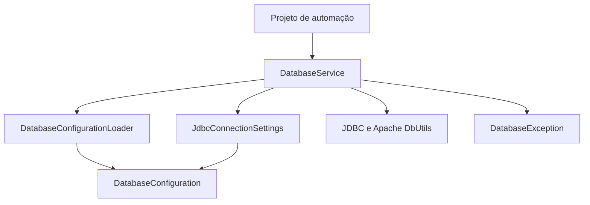

# Arquitetura

## Objetivo e contrato público

`qa-database-utils` é uma biblioteca Maven pequena, dedicada a operações JDBC em
automações de testes. O consumidor fornece a configuração de conexão e utiliza
os quatro métodos estáticos de `br.com.mindqa.database.DatabaseService`:

- `select(sql, params)`
- `selectInDb(dbName, sql, params)`
- `executeUpdate(sql, params)`
- `executeUpdateInDb(dbName, sql, params)`

O tipo do banco vem da configuração. O consumidor não instancia configurações,
drivers ou executores. `DatabaseException` é o segundo tipo público e representa
falhas JDBC com diagnóstico estruturado.

## Responsabilidades e dependências

| Componente | Responsabilidade | Limite |
| --- | --- | --- |
| `DatabaseService` | Validar argumentos, coordenar a chamada e fechar a conexão. | Não lê arquivos nem monta URLs. |
| `DatabaseConfigurationLoader` | Selecionar e ler o ambiente, o classpath e o arquivo externo. | Não abre conexões JDBC. |
| `DatabaseConfiguration` | Preservar os valores das fontes e aplicar a precedência definida. | Não executa I/O e não conhece SQL Server ou PostgreSQL. |
| `JdbcConnectionSettings` | Validar as opções JDBC, aplicar padrões e montar a URL com escapes. | Não lê arquivos, altera estado global ou executa SQL. |
| `DatabaseException` | Expor operação, banco, SQLState, código e causa original. | Não acrescenta SQL ou parâmetros à mensagem. |

O carregador fecha os recursos de leitura antes de devolver a configuração.
`DatabaseConfiguration` copia os valores recebidos para mapas imutáveis.
`JdbcConnectionSettings` mantém somente os valores validados da chamada e fornece
uma nova instância de `Properties` para cada solicitação de credenciais JDBC.

## Organização dos pacotes

O código de produção fica em um único pacote funcional:
`br.com.mindqa.database`. `DatabaseConfiguration`, `DatabaseConfigurationLoader`
e `JdbcConnectionSettings` possuem acesso restrito a esse pacote. Essa fronteira
impede que projetos consumidores dependam diretamente dos detalhes internos,
conforme as [regras de acesso da linguagem Java](https://docs.oracle.com/javase/specs/jls/se11/html/jls-6.html#jls-6.6.1).

Essa organização é adequada ao tamanho atual da biblioteca. Novos subpacotes
devem corresponder a funcionalidades com responsabilidades e fronteiras próprias;
uma mudança de pasta que exija tornar auxiliares públicos também altera a
superfície acessível aos consumidores e precisa ser avaliada como decisão de API.

As pastas seguem o [layout padrão do Maven](https://maven.apache.org/guides/introduction/introduction-to-the-standard-directory-layout.html):

| Caminho | Conteúdo |
| --- | --- |
| `src/main/java` | Código que entra na biblioteca. |
| `src/test/java` | Testes e auxiliares que não entram no JAR. |
| `src/test/java/.../support` | Processo de teste e executor de cenários em JVM isolada. |
| `src/test/java/.../integration` | Testes com bancos reais usando a API pública. |
| `docs` | Decisões e documentação de arquitetura. |
| `.github/workflows` | Validação automática no GitHub Actions. |
| `target` | Saídas geradas pelo Maven, ignoradas pelo Git. |

Recursos fixos de teste, quando necessários, pertencem a `src/test/resources`.
Os testes atuais geram arquivos temporários para isolar cenários. Arquivos com
credenciais do consumidor pertencem ao projeto consumidor ou ao ambiente de
execução; eles não são distribuídos no JAR desta biblioteca.

## Nomenclatura

- Classes em inglês e `UpperCamelCase`, com responsabilidade identificável pelo nome.
- Métodos e variáveis em `lowerCamelCase`; constantes em `UPPER_SNAKE_CASE`.
- `Loader` identifica leitura de fontes; `Configuration` identifica seus valores;
  `ConnectionSettings` identifica os valores JDBC já validados.
- `jdbcUrl`, `databaseName`, `queryTimeoutSeconds` e `loginTimeoutSeconds` explicitam
  o significado e a unidade de cada valor.
- `openConnection` e `createQueryRunner` indicam operações que criam recursos ou objetos.
- Pacotes em minúsculas, alinhados aos diretórios Java.
- Documentação e mensagens de uso em português, mantendo os identificadores da API em inglês.

Os nomes públicos `DatabaseService`, `DatabaseException` e dos quatro métodos
fazem parte do contrato do consumidor. Refatorações internas devem preservar seus
pacotes, assinaturas e comportamento.

## Execução e concorrência

1. A fachada valida SQL e parâmetros antes de realizar I/O.
2. O carregador captura as fontes de configuração para aquela operação.
3. Os valores JDBC são validados, incluindo o banco informado em `*InDb`.
4. A chamada abre sua conexão e cria um `QueryRunner` com o timeout selecionado.
5. A operação usa parâmetros preparados e fecha seus recursos.
6. Em caso de falha, o diagnóstico usa os valores capturados no início da chamada.

Cada chamada possui sua própria conexão, configuração e executor. Não há pool,
transação compartilhada ou cache global de credenciais. As mudanças em arquivos
de configuração são observadas em chamadas posteriores, sem alterar uma operação
em andamento. As opções de conexão não modificam o timeout global do `DriverManager`.

O auto-commit torna cada alteração independente. O dialecto SQL e os tipos dos
valores de resultado seguem o driver selecionado. O código consumidor permanece
responsável por preparar e limpar os dados necessários ao teste.

## Organização dos testes

| Teste ou auxiliar | Finalidade |
| --- | --- |
| `DatabaseConfigurationLoaderTest` | Arquivos, URI, classloader, UTF-8 e captura dos valores. |
| `JdbcConnectionSettingsTest` | Validação, URLs, parsing com os drivers e timeouts. |
| `DatabaseServiceTest` | Contrato da API, CRUD, configuração, falhas, recursos e concorrência. |
| `support.JdbcScenarioRunner` | Iniciar a JVM com ambiente e classpath isolados e conferir sua conclusão. |
| `support.JdbcScenarioProcess` | Executar o cenário com H2 e um driver de teste instrumentado. |
| `integration.DatabaseServiceIT` | Executar CRUD contra um servidor real usando somente a API pública. |

O sufixo `Test` identifica a suíte padrão. O sufixo `IT` identifica a suíte
ativada por `database-integration`, seguindo as
[convenções do Maven Failsafe](https://maven.apache.org/surefire/maven-failsafe-plugin/examples/inclusion-exclusion.html).
Manter os dois tipos em `src/test/java` permite usar a compilação de testes padrão
do Maven. As classes em `support` não são testes autônomos nem código de produção.

## Critérios de evolução

A arquitetura deve evoluir quando houver um requisito verificável: por exemplo,
mais motores JDBC com comportamentos distintos, múltiplas conexões nomeadas,
transações entre chamadas ou volume de conexões que justifique pooling. Cada
capacidade precisa definir seu ciclo de vida, isolamento e compatibilidade antes
de ampliar a API.

Para o escopo atual, a prioridade é manter contratos pequenos, responsabilidades
explícitas, estado por chamada e testes que verifiquem o comportamento público.
