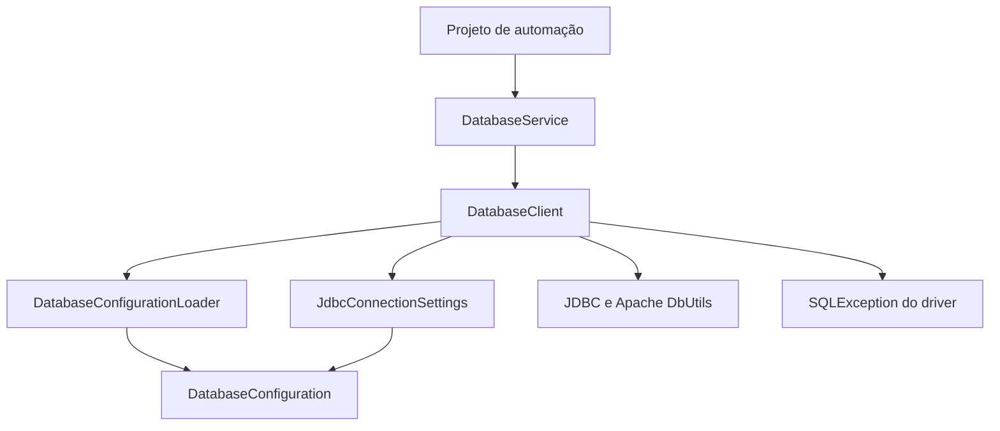

# Arquitetura

## Objetivo e contrato público

`qa-database-utils` é uma biblioteca Maven pequena, dedicada a operações JDBC em
automações de testes. O consumidor fornece a configuração de conexão e utiliza
os quatro métodos estáticos de `br.com.mindqa.database.DatabaseService`:

- `select(sql, params)`
- `selectInDb(dbName, sql, params)`
- `executeUpdate(sql, params)`
- `executeUpdateInDb(dbName, sql, params)`

Os métodos estáticos usam a conexão padrão. `DatabaseService.connection(nome)`
retorna um `DatabaseClient` com as mesmas quatro operações para um destino nomeado.
O tipo do banco vem da configuração: SQL Server, PostgreSQL, Oracle ou MySQL.
O consumidor não instancia configurações, drivers ou executores. As operações
declaram `throws SQLException` e propagam a exceção original do driver em falhas JDBC.

O código de produção depende de JDBC e Apache DbUtils, sem acoplamento a RestAssured,
JUnit, TestNG, Cucumber ou ferramentas de interface. Pode ser usado em qualquer
automação que execute Java 11+ e possua acesso ao banco configurado. As chamadas
JDBC são síncronas; o framework consumidor define quando e em qual thread executá-las.

## Uso no projeto de automação

O projeto consumidor mantém suas dependências de RestAssured e JUnit e fornece
as configurações do ambiente. Os métodos de banco não recebem o tipo de servidor;
o driver é selecionado pelo tipo configurado para a conexão.

No [exemplo de cadastro do README](../README.md#post-cadastrar-pela-api-e-validar-no-banco),
RestAssured envia `POST /clientes` e valida HTTP `201`. O teste usa o ID retornado
para consultar o cadastro com `DatabaseService.select`, compara os dados gravados
com os enviados e demonstra a limpeza do registro com `executeUpdate`.
O cenário pressupõe que a API tenha concluído a gravação antes de responder e que
a conexão do teste aponte para o mesmo banco da API.

## Configuração por ambiente

`DatabaseConfigurationLoader` seleciona um arquivo usando, nesta ordem,
`-Ddb.config`, `DB_CONFIG`, `-Ddb.env` ou `DB_ENV`. Os dois primeiros aceitam um
nome livre no classpath ou um caminho externo; os dois últimos selecionam
`database-<ambiente>.properties` no classpath. Sem seletor explícito, procura
`database.properties` na raiz do classpath. A ausência desse recurso permite
configuração somente por variáveis de ambiente e é indicada quando falta uma
chave obrigatória. Arquivos explicitamente selecionados devem existir.

Para cada chave, `DatabaseConfiguration` prioriza a variável `DB_*` sobre o valor
do arquivo, inclusive quando a variável está vazia. O arquivo aceita as formas
`DB_*` e `db.*`, com prioridade para `DB_*`. `JdbcConnectionSettings` aplica os
padrões e valida os valores resultantes. Nos métodos `*InDb`, um nome de banco
não vazio substitui `DB_NAME`, mantendo tipo, host, porta e credenciais.

A biblioteca não procura todos os arquivos `.properties` do consumidor. A convenção
automática vale apenas para `database.properties`; a seleção explícita determina
outros recursos usados em cada ambiente. Os caminhos, exemplos e
valores padrão estão no [guia de configuração](../README.md#configuração-com-qualquer-arquivo-properties).

### Conexões nomeadas e escolha do padrão

Cada nome usa um namespace próprio: `DB_CONNECTIONS_ERP_*` no ambiente ou
`db.connections.erp.*` no arquivo. Nenhuma credencial ou opção de conexão é
herdada da configuração raiz ou de outro nome. Os mesmos critérios de precedência
valem dentro de cada namespace. Somente a conexão usada pela operação é validada.

Também são aceitos aliases por motor: `ORACLE_*` declara a conexão `oracle` e
`ORACLE_ERP_*` declara `erp`. O tipo é inferido mesmo sem uma chave `TYPE`.
`SQLSERVER`, `POSTGRESQL` e `MYSQL` seguem a mesma regra. As formas com pontos e
minúsculas são aceitas no arquivo. O tipo explícito deve concordar com o prefixo.
Prefixos que disputem o mesmo nome geram erro, sem escolher pela ordem de um `Set`.

Para um mesmo nome, a precedência é ambiente antes de arquivo e chaves
`DB_CONNECTIONS_*` antes dos aliases por motor dentro de cada fonte. O seletor
`DB_DEFAULT_CONNECTION` permanece global, sem receber prefixo do motor.

A escolha explícita em `connection(nome)` prevalece. Nas chamadas estáticas,
`DB_DEFAULT_CONNECTION`/`db.default.connection` seleciona o padrão. Na ausência
desse seletor, campos de conexão na raiz preservam o comportamento original;
sem esses campos, uma única conexão nomeada é selecionada automaticamente.
Várias conexões sem padrão geram um erro de ambiguidade. Nomes desconhecidos não
fazem fallback para outro destino.

Nomes são identificadores de configuração, não nomes de bancos nem tipos de driver.
Isso permite dois destinos PostgreSQL ou Oracle com hosts e credenciais diferentes.
Eles usam letras ASCII e números, começando com uma letra, para que a conversão
entre propriedades e variáveis de ambiente seja unívoca.

`connection(nome)` retorna um cliente imutável que guarda somente o nome. Ele não
abre JDBC nem lê arquivos ao ser criado. A operação carrega uma configuração nova,
portanto reutilizar o cliente continua observando alterações posteriores no arquivo.
O cliente padrão da fachada também não guarda configurações ou conexões.

A forma `connection(nome).select(sql, params)` preserva as assinaturas existentes.
Uma sobrecarga `select(String nome, String sql, Object... params)` entraria em
conflito com consultas existentes cujo primeiro parâmetro SQL é uma `String`.

## Responsabilidades e dependências

| Componente | Responsabilidade | Limite |
| --- | --- | --- |
| `DatabaseService` | Expor operações na conexão padrão e criar clientes por nome. | Não guarda credenciais ou conexões JDBC. |
| `DatabaseClient` | Validar argumentos, resolver a conexão selecionada e executar CRUD. | Guarda somente um nome; fecha o JDBC após cada operação. |
| `DatabaseConfigurationLoader` | Selecionar e ler o ambiente, o classpath e o arquivo externo. | Não abre conexões JDBC. |
| `DatabaseConfiguration` | Preservar valores, selecionar o namespace da conexão e aplicar precedência. | Não executa I/O e não conhece os drivers. |
| `JdbcConnectionSettings` | Validar as opções JDBC, aplicar padrões e montar a URL com escapes. | Não lê arquivos, altera estado global ou executa SQL. |

O `DatabaseClient` não substitui a `SQLException` por outra exceção. Ele preserva
classe, mensagem, SQLState, código e cadeia de exceções do driver. Se a operação
falhar e o fechamento também falhar, `try-with-resources` anexa a segunda falha
como exceção suprimida. A biblioteca não acrescenta SQL ou parâmetros à mensagem.

O carregador fecha os recursos de leitura antes de devolver a configuração.
`DatabaseConfiguration` copia os valores recebidos para mapas imutáveis.
`JdbcConnectionSettings` mantém somente os valores validados da chamada e fornece
uma nova instância de `Properties` para cada solicitação de credenciais JDBC.

## Organização dos pacotes

O código de produção fica em um único pacote funcional:
`br.com.mindqa.database`. `DatabaseConfiguration`, `DatabaseConfigurationLoader`
e `JdbcConnectionSettings` possuem acesso restrito a esse pacote. Essa fronteira
impede que projetos consumidores dependam diretamente dos detalhes internos,
conforme as [regras de acesso da linguagem Java](https://docs.oracle.com/javase/specs/jls/se11/html/jls-6.html#jls-6.6.1).

Essa organização é adequada ao tamanho atual da biblioteca. Novos subpacotes
devem corresponder a funcionalidades com responsabilidades e fronteiras próprias;
uma mudança de pasta que exija tornar auxiliares públicos também altera a
superfície acessível aos consumidores e precisa ser avaliada como decisão de API.

As pastas seguem o [layout padrão do Maven](https://maven.apache.org/guides/introduction/introduction-to-the-standard-directory-layout.html):

| Caminho | Conteúdo |
| --- | --- |
| `src/main/java` | Código que entra na biblioteca. |
| `src/test/java` | Testes e auxiliares que não entram no JAR. |
| `src/test/java/.../support` | Processo de teste e executor de cenários em JVM isolada. |
| `src/test/java/.../integration` | Testes com bancos reais usando a API pública. |
| `docs` | Decisões e documentação de arquitetura. |
| `.github/workflows` | Validação automática no GitHub Actions. |
| `target` | Saídas geradas pelo Maven, ignoradas pelo Git. |

Recursos fixos de teste pertencem a `src/test/resources`;
`database.properties` contém exemplos dos quatro motores e é carregado quando não
há seletor explícito. Os testes que validam apenas variáveis de ambiente usam uma
configuração vazia isolada. Os métodos ilustrativos ficam em
`src/test/java/.../exemplo`.
Eles compilam, mas não executam automaticamente. Arquivos com
credenciais do consumidor pertencem ao projeto consumidor ou ao ambiente de
execução; eles não são distribuídos no JAR desta biblioteca.

## Nomenclatura

- Classes em inglês e `UpperCamelCase`, com responsabilidade identificável pelo nome.
- Métodos e variáveis em `lowerCamelCase`; constantes em `UPPER_SNAKE_CASE`.
- `Loader` identifica leitura de fontes; `Configuration` identifica seus valores;
  `ConnectionSettings` identifica os valores JDBC já validados.
- `jdbcUrl`, `databaseName`, `queryTimeoutSeconds` e `loginTimeoutSeconds` explicitam
  o significado e a unidade de cada valor.
- `openConnection` e `createQueryRunner` indicam operações que criam recursos ou objetos.
- Pacotes em minúsculas, alinhados aos diretórios Java.
- Documentação e mensagens de uso em português, mantendo os identificadores da API em inglês.

Os nomes públicos `DatabaseService`, `DatabaseClient` e dos métodos fazem parte do
contrato do consumidor. A versão 2.0.0 altera esse contrato ao propagar
`SQLException` diretamente; consumidores devem declarar ou tratar a exceção.
Refatorações internas posteriores devem preservar pacotes, assinaturas e comportamento.

## Execução e concorrência

1. O cliente valida SQL e parâmetros antes de realizar I/O.
2. O carregador captura as fontes de configuração para aquela operação.
3. A configuração resolve a conexão e os valores JDBC são validados, incluindo `*InDb`.
4. A chamada abre sua conexão e cria um `QueryRunner` com o timeout selecionado.
5. A operação usa parâmetros preparados e fecha seus recursos.
6. Em caso de falha JDBC, a exceção original do driver chega ao consumidor.

Cada chamada possui sua própria conexão, configuração e executor. Não há pool,
transação compartilhada ou cache global de credenciais. As mudanças em arquivos
de configuração são observadas em chamadas posteriores, sem alterar uma operação
em andamento. As opções de conexão não modificam o timeout global do `DriverManager`.

O auto-commit torna cada alteração independente. O dialecto SQL e os tipos dos
valores de resultado seguem o driver selecionado. O código consumidor permanece
responsável por preparar e limpar os dados necessários ao teste.

No Oracle, o banco de destino é um service name; `*InDb` troca esse serviço e não
o schema. A conexão usa JDBC Thin/Easy Connect por TCP. O MySQL usa Connector/J.
O timeout de conexão usa a propriedade e a unidade de cada driver: `loginTimeout`
em segundos no SQL Server/PostgreSQL, `oracle.jdbc.loginTimeout` em segundos no
Oracle e `connectTimeout` em milissegundos no MySQL. Neste último, o limite cobre
a abertura do socket, não todo o handshake de autenticação.

## Organização dos testes

| Teste ou auxiliar | Finalidade |
| --- | --- |
| `DatabaseConfigurationLoaderTest` | Arquivos, URI, classloader, UTF-8 e captura dos valores. |
| `DatabaseConfigurationTest` | Seleção padrão/nomeada, isolamento de valores e precedência das fontes. |
| `JdbcConnectionSettingsTest` | Validação, URLs, parsing com os drivers e timeouts. |
| `DatabaseServiceTest` | Contrato da API, clientes nomeados, CRUD, configuração, falhas, recursos e concorrência. |
| `support.JdbcScenarioRunner` | Iniciar a JVM com ambiente e classpath isolados e conferir sua conclusão. |
| `support.JdbcScenarioProcess` | Executar o cenário com H2 e um driver de teste instrumentado. |
| `integration.DatabaseServiceIT` | Executar CRUD contra um servidor real usando somente a API pública. |

Os cenários em JVM isolada verificam quatro conexões simultâneas, duas bases por
conexão e credenciais distintas. A integração também oferece um cenário opt-in
com `db.integration.connections` e `db.integration.alternate`, que usa a mesma
tabela e dados distintos em servidores e bases diferentes no mesmo método de teste.

O sufixo `Test` identifica a suíte padrão. O sufixo `IT` identifica a suíte
ativada por `database-integration`, seguindo as
[convenções do Maven Failsafe](https://maven.apache.org/surefire/maven-failsafe-plugin/examples/inclusion-exclusion.html).
Manter os dois tipos em `src/test/java` permite usar a compilação de testes padrão
do Maven. As classes em `support` não são testes autônomos nem código de produção.

## Critérios de evolução

A arquitetura deve evoluir quando houver um requisito verificável: por exemplo,
mais motores JDBC com comportamentos distintos,
transações entre chamadas ou volume de conexões que justifique pooling. Cada
capacidade precisa definir seu ciclo de vida, isolamento e compatibilidade antes
de ampliar a API.

Para o escopo atual, a prioridade é manter contratos pequenos, responsabilidades
explícitas, estado por chamada e testes que verifiquem o comportamento público.
